========================
PyAtomDB Example Scripts
========================

----------------
Module Structure
----------------

These are examples of using the PyAtomDB module in your projects. They can all be found in the examples subdirectory of your PyAtomDB installation.

The examples here are separated by the module in which they are implemented. Generally speaking, the roles of these modules can be split into the following areas:

spectrum
  Obtaining emissivities from the AtomDB emissivity files (e.g. the ``apec`` model). This module is used to create spectra as required.

apec
  Related to the APEC code - creating the AtomDB emissivity files from the underlying atomic database

atomdb
  Accessing the atomic database - returning rates and coefficients, fetching files

atomic
  Basic atomic functions - getting atomic masses, converting to element symbols etc.

util
  File utilities (not generally interesting to end users)

const
  List of physical constants and code-related constants used throughout PyAtomDB (again, not generally interesting to end users)

-------
Spectra
-------
The spectrum.py module contains routines for taking the spectrum generated from the
apec model and extracting line emissivities or continuum emission, applying responses,
changing abundances, etc. In these examples, we will use the
`Chandra ACIS-S MEG +1 <https://cxc.cfa.harvard.edu/caldb/prop_plan/grating/index.html>`_
order grating responses as examples where one is required, but you can use any.

Similarly, we use ``pylab`` for plotting. You can of course use whatever system you
like for plotting, this is just what we did. It is included in matplotlib and
therefore hopefully present on most systems.

++++++++++++++++
CIESession Class
++++++++++++++++

The heart of the spectral analysis is the spectrum.py class. This reads in the results of an apec run (by default, $ATOMDB/apec_line.fits and $ATOMDB/apec_coco.fits) and allows the user to obtain spectra at a range of temperatures accounting for instrument responses, thermal and velocity broadening,  abundance changes and other issues.

~~~~~~~~~~~~~~~~~
Making a Spectrum
~~~~~~~~~~~~~~~~~

.. literalinclude:: ../examples/spectrum_session_examples_1.py

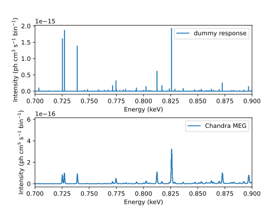

    A kT=0.4keV simple spectrum created with and without an instrument response
    
~~~~~~~~~~~~~~~~~~~~~~~~~~~~~~~~
Handling Large Response Matrices
~~~~~~~~~~~~~~~~~~~~~~~~~~~~~~~~

Some missions, for example XRISM, have a large number of bins in their response files (XRISM has 50,000). Creating a 50,000x50,000 response matrix would require of order 16GB of memory, most of which would be zeros. Setting ``sparse=True`` when setting the response will use `sparse matrices <https://docs.scipy.org/doc/scipy/reference/sparse.html>`_ to save memory. The code below shows how to do this and also how to compare any innacuracies caused (testing so far has shown nothing larger than numerical rounding errors, 1 part in 10 :sup:`15`)

.. literalinclude:: ../examples/spectrum_session_examples_1b.py

.. figure:: ../examples/spectrum_session_examples_1_1b.svg
    :align: center
    :alt: Spectrum Example 1(b) - sparse matrices for large responses
    :figclass: align-center

    A kT=0.4keV simple spectrum created with regular and sparse instrument responses. The same code can be used to compare the accuracy of the two methods for different response matrices, but will require large amounts of memory if using large responses.

~~~~~~~~~~~~~~~
Line Broadening
~~~~~~~~~~~~~~~

By default, line broadening is off. The command ``session.set_broadening`` allows you to turn on thermal broadening and, if desired, add additional turbulent velocity broadening too.

.. literalinclude:: ../examples/spectrum_session_examples_2.py

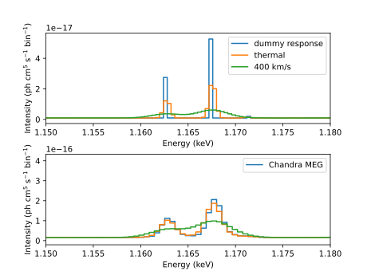

    A kT=3.0keV spectrum unbroadened, thermally broadened and then additionally velocity broadend.

~~~~~~~~~~~~~~~~~~~
Changing Abundances
~~~~~~~~~~~~~~~~~~~

There are several ways to change the abundances. By default, all are set to 1.0 times the solar value of `Anders and Grevesse <http://adsabs.harvard.edu/abs/1989GeCoA..53..197A>`_.
The ``session.set_abund`` command implements this.

.. literalinclude:: ../examples/spectrum_session_examples_3_abund.py

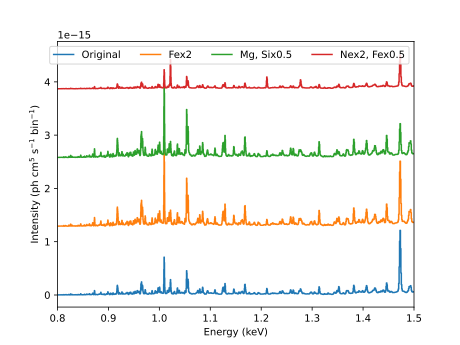

    A kT=1.0keV spectrum with assorted different abundances applied.

You can also change the entire abundance set in use using ``session.set_abundset``.

.. literalinclude:: ../examples/spectrum_session_examples_4_abund.py

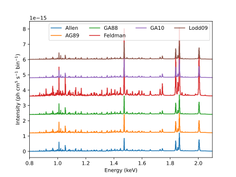

    A kT=1.0keV spectrum with assorted different abundance sets applied.

~~~~~~~~~~~~~~~~
Return line list
~~~~~~~~~~~~~~~~

To obtain a list of lines and their emissivities in a spectral range, use ``session.return_linelist``. This
returns the data as a numpy array of the lines in the region, applying all current abundance information
to the linelist. It also interpolates in temperature between the two nearest points. Note
that since AtomDB cuts off lines with emissivities below :math:`10^{-20}` :math:`ph ~ cm^3 s^{-1}`, lines
will diappear below this emissivity. Lines beyond the last temperature point at which they are tabulated will
not be included in the returned linelist.

.. literalinclude:: ../examples/spectrum_session_examples_5_linelist.py

~~~~~~~~~~~~~~~~~~~~~~
Return line emissivity
~~~~~~~~~~~~~~~~~~~~~~

To calculate the emissvitiy of a specific line, you can use ``session.return_line_emissivity`` along
with the ion, element, upper and lower levels of the transition. You can supply a single or a range
of temperatures, and a dictionary will be returned containing much of the information along with
emissivity (epsilon) you requested.

.. literalinclude:: ../examples/spectrum_session_examples_6_line_emissivity.py

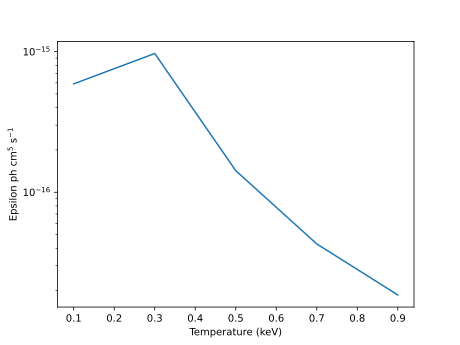

    Emissivity of the resonance line of O VII.

++++++++++++++++
NEISession Class
++++++++++++++++

Derived from the CIESession class, this handles non-equilibrium spectra. As such, all of the calls to it are
exactly the same. Adding response, setting abundances obtaining spectra, etc all work the same way.
Therefore I will only outline what is different.

The main difference is that a non equilibrium plasma requires 2 more pieces of information to define it. The
current electron temperature is as with the CIE case. The other two are:

  tau
    The ionization timescale (:math:`n_e t`) in |cm-3s| since the plasma left its previous
    equilibrium
  init_pop
    The initial population the plasma was in at tau=0.

Tau is a single number in all cases. init_pop can be be defined in a range of ways:

  float
    If it is a single number, this is assumed to be an electron temperature. The ionization fraction will
    be calculated at this :math:`T_e`.

  dict
    If a dictionary is provided, it should be an explicit ionization fraction for each element.
    So dict[6]= [0.0, 0.1, 0.2, 0.3, 0.3, 0.1, 0.0] would be the ionization fraction for carbon,
    dict[8]= [0.0, 0.0, 0.1, 0.1, 0.1, 0.15,0.3,0.2,0.05] would be for oxygen etc.

  'ionizing'
    If the string ionizing is provided, set all elements to be entirely neutral. This is the default.

  'recombining'
    If the string recombining is provided, set all elements to be fully ionized.

~~~~~~~~~~~~~~~~~
Making a Spectrum
~~~~~~~~~~~~~~~~~

As an example, this will plot a simple recombining spectrum within initial temperature of 1.0keV.

.. literalinclude:: ../examples/spectrum_session_examples_7_nei.py

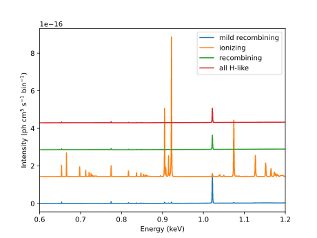

    Recombining spectrum specified by an initial temperature

~~~~~~~~~~~~~~~~~
Making a Linelist
~~~~~~~~~~~~~~~~~

This is again exactly the same as the CIESession case, except with extra parameters ``tau`` and ``init_pop``.
The only additional option is the ability to separate the linelist by driving ion. This is the ion which gives
rise to the emission. For example, if the emission is largely from ionization into an excited state and then
subsequent cascade, then that part of the emissivity has a different driving ion than that driven by
excitation of the ion's ground state.

Separating out these features can be turned on and off using the ``by_ion_drv`` keyword,

.. literalinclude:: ../examples/spectrum_session_examples_8_nei_linelist.py

-------------------
Getting Atomic Data
-------------------
The ``atomdb`` module is designed to read data from the database and either
return raw opened files (e.g. all the energy levels of an ion) or
individual useful data (e.g. a rate coefficient).

AtomDB stores data sorted by ion in a series of files in the ``$ATOMDB/APED``. There are several files for
each ion, covering different data types:

       *           'IR' - ionization and recombination
       *           'LV' - energy levels
       *           'LA' - radiative transition data (lambda and A-values)
       *           'EC' - electron collision data
       *           'PC' - proton collision data
       *           'DR' - dielectronic recombination satellite line data
       *           'PI' - XSTAR photoionization data
       *           'AI' - autoionization data
       *           'ALL' - reads all of the above. Does not return anything. Used for bulk downloading.

       Or, for non-ion-specific data (abundances and bremstrahlung coeffts):

       *           'ABUND' - abundance tables
       *           'HBREMS' - Hummer bremstrahlung coefficients
       *           'RBREMS' - relativistic bremstrahlung coefficitients
       *           'IONBAL' - ionization balance tables
       *           'EIGEN'  - eigenvalue files (for non-equilibrium ionization)

The raw atomic data files can be downloaded using ``atomdb.get_data``.

.. note:: Datacache

    Often, when using AtomDB data you will want to use the same file over and over again. However,
    the whole database is too large to be loaded into memory as a matter of course. To get around this,
    the ``datacache`` keyword is used in several routines. This is a dictionary which is populated
    with any data files that you have to open. The atomdb function which ultimately opens the raw
    data files, ``get_data``, will always check for an already existing data file here before
    going to the disk to open the file anew. If there is no data there, then the file is opened
    and its data is stored in the datacache so that next time the routine is called it will
    already be there.

    If you need to save memory, you can empty the cache by declaring the datacache as a
    new dictionary, i.e. ``datacache={}``.

.. literalinclude:: ../examples/atomdb_example_1_get_data.py

+++++++++++++++++++++++++
Getting Rate Coefficients
+++++++++++++++++++++++++

Ionization, recombination, and excitation rate coefficients can all be
obtained using ``get_maxwell_rate``.

.. literalinclude:: ../examples/atomdb_example_2_get_maxwell.py

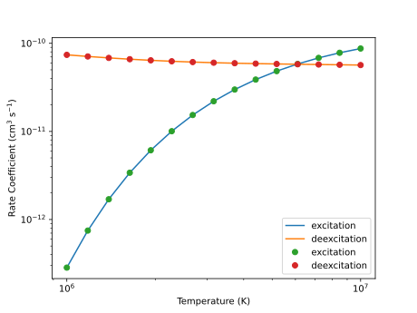

    Excitation rates for O\ :sup:`6+`.

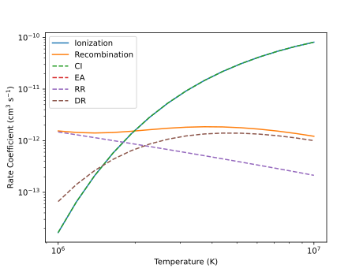

    Ionization and recombination rates for O\ :sup:`6+` to O\ :sup:`7+`.
    Note that for the components breakdown, there is no excitation autionization
    contribution in the files.

-----------------------------
Calculating Plasma Conditions
-----------------------------
The ``apec`` module is used for calculating plasma related phenomena. For example,
ionization fractions, non-equilibrium ionization, level populations, emission spectra.
Currently, it is mostly written in such a way that it is difficult to use it outside
of running the entire APEC code. A rewrite will happen soon. However, for now,
here are a couple of useful routines which should be useable.

+++++++++++++++++++++++++++++++++
Getting Charge State Distribution
+++++++++++++++++++++++++++++++++

.. literalinclude:: ../examples/apec_example_1_get_ionbal.py

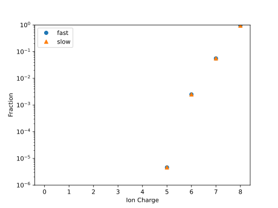

    Ionization balance for oxygen

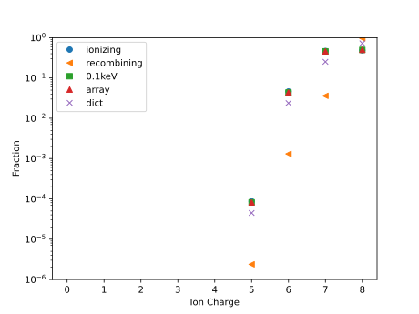

    Charge state distribution calculated many different ways for
    non equilibrium ionization.

--------------------------------
Including APEC models in PyXSPEC
--------------------------------

.. literalinclude:: ../examples/wrapper_xspec_examples.py

There are other wrapper files which work in the same way for a model with
a separate temperature set for line broadening, and others will be added in 
the ``wrapper`` directory.

--------------------
Individual Use Cases
--------------------

These are typically scripts created to answer user's questions which might be interesting. As a result,
sometimes the exact response files etc may not be available to you. Please swap in what you need to.

+++++++++++++++++++++
Get PI Cross Sections
+++++++++++++++++++++

Extract the PI cross section data:  ``photoionization_data.py``

.. literalinclude:: ../examples/photoionization_data.py

++++++++++++++++++
Make Cooling Curve
++++++++++++++++++

Make a cooling curve, total emissivity in keV cm3 s-1, for each element
in a specfied spectral range (e.g. 2 to 10 keV).

.. literalinclude:: ../examples/calc_power.py

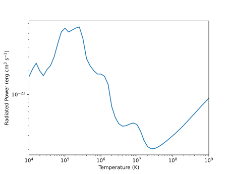
    
    The total emissivity of the plasma between 0.001 and 100 keV.
    
.. |cm3| replace:: cm\ :sup:`3`
.. |cm-3| replace:: cm\ :sup:`-3`
.. |cm-3s| replace:: cm\ :sup:`-3` s\ :sup:`1`
.. |cm3s-1| replace:: cm\ :sup:`3` s\ :sup:`-1`

